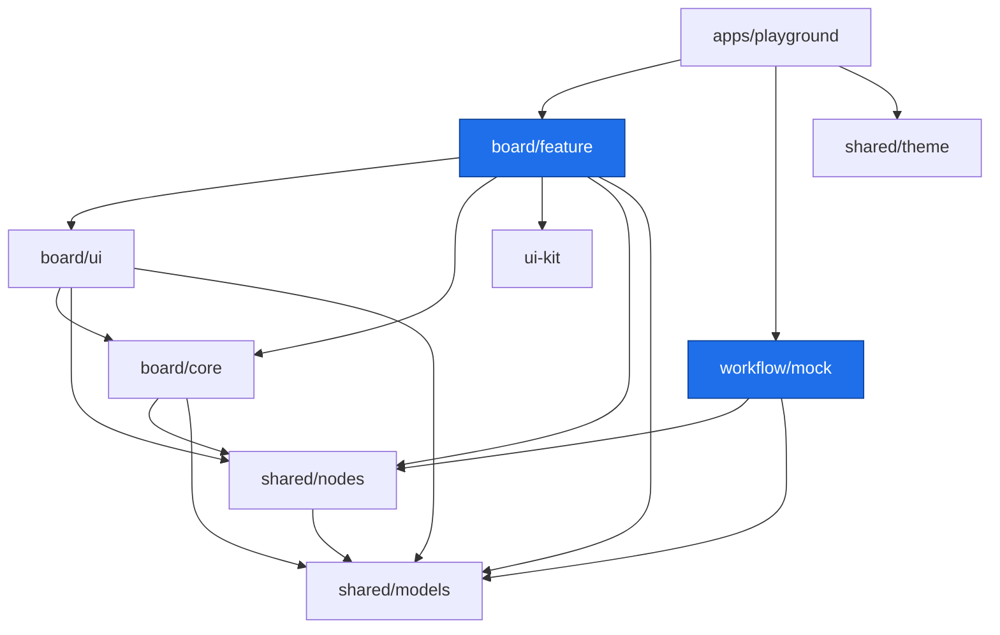

# Architecture

Документ описывает архитектуру монорепозитория **Pipeline Editor**: домены, слои
библиотек, модель данных холста, контракт с бэкендом и границы модулей.

Итоговый артефакт — набор **публикуемых Angular-библиотек**, из которых внешнее
приложение собирает визуальный редактор пайплайнов AI-агентов (вдохновлён
[n8n](https://n8n.io)). Приложение `playground` существует только для локальной
разработки и не публикуется.

---

## 1. Цель и принципы

1. **Фронт НЕ исполняет пайплайн.** Семантикой узлов владеет бэкенд («система»,
   работающая 24/7). Фронт — это **редактор графа + схема данных + вендор-нейтральный
   порт** `PipelineBackend` (`startRun` / `observe` / `stop`). Редактор рисует граф,
   валидирует его структуру и наблюдает за прогоном; он не знает, что узел делает на
   самом деле. См. [§6](#6-домен-workflow--контракт-с-бэкендом).
2. **Разделение «редактор ↔ бизнес».** Холст (рисование, навигация, редактирование
   графа) ничего не знает о конкретных интеграциях. Их описывает реестр типов узлов
   (`shared/nodes`), а исполняет — бэкенд.
3. **Слоистость.** Каждая библиотека имеет тип `model → util → core → ui → feature`.
   Зависимости идут только «сверху вниз»; это гарантируют теги и
   `@nx/enforce-module-boundaries` (см. [§7](#7-границы-модулей)).
4. **Presentational-компоненты в `ui`, состояние в `core`.** UI-компоненты «глупые»
   (`input()/output()`, `OnPush`), состояние — в signal-сторах слоя `core`.
5. **Модель данных — единый источник правды.** И редактор, и бэкенд оперируют одной
   сериализуемой моделью пайплайна из `shared/models`.
6. **Всё через Nx.** Сборка, тесты, линт, релиз — только `nx run/run-many/affected`.

---

## 2. Домены

| Домен        | scope-тег        | Назначение                                                                    |
| ------------ | ---------------- | ----------------------------------------------------------------------------- |
| **board**    | `scope:board`    | Холст: стор графа, viewport, навигация, узлы, рёбра, роутинг связей.          |
| **workflow** | `scope:workflow` | Реализации порта `PipelineBackend`. Сейчас — `mock` (in-browser мок-система). |
| **shared**   | `scope:shared`   | Модель данных, реестр типов узлов, тема, переиспользуемый ui-kit.             |
| **app**      | `scope:app`      | Host-приложение(я): `playground`.                                             |

Домен **board** отвечает «как это выглядит и как этим управляют мышью». Домен
**workflow** — «через какой бэкенд это исполняется». Связывает их сериализуемая
модель пайплайна и контракт `PipelineBackend` из `shared/models`.

---

## 3. Карта библиотек

```
apps/
  playground/               @scope:app  type:app         host-приложение (nx serve → /board)

packages/
  shared/
    models/                 @tsai-pe/shared/models   scope:shared type:model  ← типы + валидация + контракт бэкенда
    nodes/                  @tsai-pe/shared/nodes    scope:shared type:model  ← реестр типов узлов (derivePorts, каталог, схемы)
    theme/                  @tsai-pe/shared/theme    scope:shared type:util   ← Tailwind-токены + глобальный CSS
  ui-kit/                   @tsai-pe/ui-kit          scope:shared type:ui     ← Angular Aria + CDK + Tailwind

  board/
    core/                   @tsai-pe/board/core      scope:board  type:core   ← BoardStore, viewport, geometry, A*-роутинг
    ui/                     @tsai-pe/board/ui        scope:board  type:ui     ← pe-board-grid, pe-node
    feature/                @tsai-pe/board/feature   scope:board  type:feature ← <pe-board> — публичный редактор

  workflow/
    mock/                   @tsai-pe/workflow/mock   scope:workflow type:core ← TestBackendSystem (in-browser мок-адаптер)
    http/                   @tsai-pe/workflow/http   scope:workflow type:core ← RestWsBackend (REST + WS/SSE адаптер, скелет)
```

Публичный npm-scope — **`@tsai-pe`**. Реестр типов узлов вынесен в отдельную либу
`shared/nodes` (не в `models`) намеренно: его читают и редактор, и будущий движок —
он данные, а не логика конкретного слоя.

### Граф зависимостей



Ключевое: **`board/*` и `workflow/*` не зависят друг от друга** — только через
`shared/*`. Редактор можно собрать без какого-либо бэкенда; бэкенд-адаптер можно
писать и тестировать без редактора.

---

## 4. UI-kit и стилизация

### 4.1 ui-kit на Angular Aria (type:ui)

Переиспользуемые компоненты (кнопки, поля, селекты, меню, диалоги, тосты, табы…)
строятся на **[Angular Aria](https://angular.dev/guide/aria/overview)** — headless
доступных директивах (клавиатура, фокус, ARIA) **без визуальных стилей** — плюс
`@angular/cdk` для инфраструктуры: **Overlay** (поповеры, меню, модалки), **Portal**,
**a11y** (focus trap диалогов), **Virtual Scroll** (длинные списки). Вся вёрстка и
стили — свои, через Tailwind + токены темы.

### 4.2 Стили: Tailwind v4 (CSS-first)

Стилизуемся на **Tailwind v4** без `tailwind.config.js`. Единый вход и токены —
в `@tsai-pe/shared/theme` (`theme.css` — токены как CSS-переменные; `index.css` —
`@import "tailwindcss"` + маппинг токенов в `@theme` + хелперы холста).

Подключение в приложении (`styles.css`):

```css
@import '@tsai-pe/shared/theme';
@source '../../../packages/board'; /* сканирование классов из библиотек, включая .ts */
@source '../../../packages/ui-kit';
```

**Решение по стилям (не ломать):** Tailwind везде, **включая host-классы** через
`host: { class: '…' }` в декораторе — Tailwind сканирует `.ts` благодаря `@source
packages/board`. Компонентный `.css` допустим **только** для того, что не выразить
утилитами (состояние на host, SVG); на сегодня такого нет — файлов `.css` в
библиотеках нет. Библиотеки собственного Tailwind-шага не требуют: их классы
подхватывает сканирование приложения.

### 4.3 Тема

Dark-first, «premium/technological» (Linear/Vercel × Apple glass): единый акцент —
электрический индиго, нейтральный near-black фон, hairline-бордеры вместо теней.
Роли/типы узлов кодируются приглушёнными тинтами (2px-рейл, точка порта, иконка);
тело узла нейтральное. Light-тема — зеркало тех же токенов (`class="light"` на
`<html>`). `ui-kit` и `shared/theme` — `scope:shared`, доступны всем доменам и сами
ни от `board`, ни от `workflow` не зависят.

---

## 5. Домен board (холст)

Визуальное редактирование графа. Три слоя.

### 5.1 `board/core` — состояние и логика (type:core)

Чистый TS + Angular signals, без шаблонов:

- **`BoardStore`** — сигнальный документ-стор: узлы, рёбра, выделение, история
  (undo/redo, лимит 100), буфер обмена (copy/paste со сдвигом), viewport. Наружу —
  read-only сигналы. Считает `edgeGeometries` (роутинг всех рёбер), `contentBounds`,
  живую валидацию `issues`, `ancestorsOf(id)` (предки узла в DAG — контекст
  выражений). Валидирует связи (`canConnect`: output→input, без цикла, 1:1-вход).
- **`Viewport`** — pan `{x,y}` + zoom со зажимом, `screen ↔ world`, `zoomAround`
  (масштаб относительно курсора), `fitTo`.
- **`geometry`** — сетка (32-px клетка), `nodeRect`, `portAnchor` (порты
  распределены по фракции стороны), пересечения прямоугольников, безье-путь ребра.
- **`routing`** — ортогональный роутинг рёбер по 16-субсетке через **A\***: обход
  нод (инфляция), мягкое отталкивание от уже проложенных рёбер, штраф за повороты;
  фолбэк на безье, если путь не найден.

Зависит от: `shared/models`, `shared/nodes`.

### 5.2 `board/ui` — presentational-компоненты (type:ui)

«Глупые» `OnPush`-компоненты (prefix `pe`):

- **`pe-board-grid`** — фон-сетка точек, реагирует на viewport.
- **`pe-node`** — визуал узла: порты по фракции стороны, подписи ветвей control-flow,
  оверлеи статуса/прогресса прогона.

Зависит от: `board/core`, `shared/models`, `shared/nodes`.

### 5.3 `board/feature` — собранный редактор (type:feature) · публичная точка

Компонент `<pe-board>`: связывает `BoardStore` с компонентами `board/ui`,
обрабатывает клавиатуру/мышь (pan/zoom ПКМ/средней/Space, marquee-выбор,
drag&drop из палитры-каталога, copy/paste, undo/redo, хоткеи, ресайз, контекст-меню,
направляющие, delete-safety), рисует minimap и инспектор (параметры из каталога +
Run data), панель issues и лога прогона. Инжектит бэкенд через токен
`PIPELINE_BACKEND` и наблюдает прогон. Модалки/кнопки — из `ui-kit`.

Зависит от: `board/core`, `board/ui`, `ui-kit`, `shared/models`, `shared/nodes`.

---

## 6. Домен workflow + контракт с бэкендом

Фронт исполнения не содержит. Он общается с бэкендом через вендор-нейтральный порт
`PipelineBackend` (в `shared/models/backend.ts`):

```ts
interface PipelineBackend {
  startRun(pipeline: Pipeline): string;             // отправить на прогон → runId
  observe(runId: string, listener: RunListener): Unsubscribe; // подписка; листенер
                                                    // сразу зовётся с текущим состоянием
  stop(runId: string): void;                        // запросить отмену
}
```

Бэкенд пушит наблюдателям неизменяемые `RunSnapshot` на каждое изменение:
`{ runId, status, nodes: Record<id, NodeRun>, log: RunLogEntry[] }`, где `NodeRun`
несёт `status` (idle/running/success/error), опциональные `error`, `output`,
`progress: { done, total }` (для split/merge). Контракт **framework-free**
(колбэки, без Signal/Observable), чтобы жить в `shared` рядом с моделью.

### `workflow/mock` — `TestBackendSystem` (type:core)

In-browser мок «системы», реализующий `PipelineBackend`. Кооперативно (через
`setTimeout`, отменяемо) обходит граф в топопорядке (Kahn; цикл → отказ прогона) и
эмитит снапшоты по мере переходов узлов idle → running → success/error. Моделирует:

- **control-flow** — исполняется только «взятая» ветка (`derivePorts`/выбранный
  выходной порт); остальные узлы за не взятой ветвью пропускаются;
- **fan-out `split → merge`** — `split ×N` размножает поток (каждый узел между split
  и merge исполняется N раз, прогресс n/n, «×N» в логе), `merge` схлопывает в 1;
- **ошибки** — фатальные валят прогон; необязательный `effect` (`required: false`,
  напр. логгер) — нет.

Реальный REST/WS-адаптер — просто другая реализация того же порта; редактор его не
отличает. Инжектится в `<pe-board>` через `PIPELINE_BACKEND`.

### Персистентность — порт `PipelineStore`

Отдельный от прогона порт (`shared/models/store.ts`): `save` / `load` / `list` /
`remove` пайплайнов + `runHistory`. **Async** (Promise-based) — персистентность
удалённа по природе (в отличие от sync-порта прогона). `InMemoryPipelineStore`
(`workflow/mock`) — in-browser реализация: хранит документы с deep-clone на входе и
выходе, так что состояние стора нельзя мутировать по ссылке. Реальный REST-стор —
другая реализация того же порта.

### `workflow/http` — `RestWsBackend` (type:core)

Скелет реальной реализации порта: команды по **REST** (`POST /runs`,
`POST /runs/{id}/stop`), снапшоты прогона — потоком (**WebSocket**/SSE). Проверяет
контракт об реальный транспорт. Транспорт (`fetch` + фабрика сокета) инъектируется —
либа остаётся headless и юнит-тестируемой без сети.

**Найденная развилка (sync/async).** Порт `startRun` возвращает id **синхронно**, а
REST назначает id **асинхронно**. Решение: адаптер сразу отдаёт **локальный** id,
шлёт POST в фоне и, получив серверный id, открывает стрим и **ремапит** серверные
снапшоты на локальный id. Вызывающий работает только с локальным id и реконсиляции
не видит. Это сигнал для будущей «зрелости контракта»: возможно, `startRun` стоит
сделать асинхронным.

---

## 7. Границы модулей

Заданы в `eslint.config.mjs` (`@nx/enforce-module-boundaries`), проверяются линтом.
Импорт разрешён, только если проходит **и** scope-, **и** type-ограничения.

### Scope (кто какой домен видит)

| sourceTag        | может зависеть от                                            |
| ---------------- | ------------------------------------------------------------ |
| `scope:shared`   | `scope:shared`                                               |
| `scope:board`    | `scope:board`, `scope:shared`                                |
| `scope:workflow` | `scope:workflow`, `scope:shared`                             |
| `scope:app`      | `scope:app`, `scope:board`, `scope:workflow`, `scope:shared` |

### Type (слоистость)

| sourceTag      | может зависеть от                        |
| -------------- | ---------------------------------------- |
| `type:app`     | `feature`, `ui`, `core`, `util`, `model` |
| `type:feature` | `feature`, `ui`, `core`, `util`, `model` |
| `type:ui`      | `ui`, `core`, `util`, `model`            |
| `type:core`    | `core`, `util`, `model`                  |
| `type:util`    | `util`                                   |
| `type:model`   | `model`                                  |

`shared/nodes` тегирован `type:model`: он зависит только от `shared/models`
(`model → model`), а все потребители (`core`/`ui`/`feature`/`app`) вправе тянуть
`type:model`. Так, `ui-kit` (`type:ui`) технически может зависеть от `type:core`, но
scope-правило не даст ему тянуть `board/core` (`scope:board`) — оба ограничения
должны выполняться одновременно.

---

## 8. Модель данных

Единая сериализуемая модель в `shared/models` — контракт редактора и бэкенда.

```ts
// grid-based координаты (в клетках 32-сетки)
type NodeKind = 'trigger' | 'action' | 'effect';
type ActionCategory =
  | 'control-flow' | 'transform' | 'integration' | 'split' | 'merge';

interface NodePort {
  id: string;
  role: 'input' | 'output';
  side: 'left' | 'right' | 'top' | 'bottom';
  label?: string; // напр. имя ветви control-flow ("true"/"false")
}

interface BoardNode {
  id: string;
  kind: NodeKind;
  category?: ActionCategory;      // для kind === 'action'
  type?: string;                  // конкретный тип из каталога (напр. 'llm-agent')
  title: string;
  pos: GridPos;                   // { col, row } — клетки
  size: CellSize;                 // { cols, rows }
  ports: NodePort[];              // выводятся реестром из kind/config
  config?: NodeConfig;            // только control-flow (if/switch/filter)
  data?: Record<string, unknown>; // значения параметров узла
  status?: NodeStatus;            // оверлей прогона
}

interface Edge { // output-порт → input-порт
  id: string;
  source: { nodeId: string; portId: string }; // выход
  target: { nodeId: string; portId: string }; // вход
}

interface Pipeline { id: string; name: string; nodes: BoardNode[]; edges: Edge[]; }
```

**Fan-in разрешён.** Вход принимает **несколько** входящих связей (семантика OR /
run-on-arrival): разные источники — например несколько триггеров telegram/whatsapp/
slack — сходятся на одной ноде, которая срабатывает, когда пришло из любого. Это
союз источников, и он ортогонален `split`/`merge` — те про кардинальность **одного**
потока (`split` раздаёт элементы массива, `merge` буферизует N событий в `Array[N]`),
а не про объединение разных. Валидация (`validatePipeline` в `models`): граф — DAG
(без циклов), связь идёт `output → input`, несвязанные узлы — warning. Дубли одной и
той же связи `connect` не создаёт.

### Реестр типов узлов — `shared/nodes`

Реестр (n8n-стиль) читают и редактор, и будущий движок:

- **control-flow** (`if`/`switch`/`filter`) — фиксированный набор со своей формой;
  выходные порты **выводятся из конфига** (`derivePorts` / `controlFlowOutputs`),
  `defaultControlFlowConfig` даёт стартовую конфигурацию.
- **trigger / integration / effect** — **открытые**: у каждого конкретного `node.type`
  из `NODE_CATALOG` своя схема параметров (`ParamField[]`, `paramSchema`), значения —
  в `node.data`. Каталог здесь — сид; реальный бэкенд поставит свой.

---

## 9. Playground

`apps/playground` (`scope:app`, `type:app`) — минимальное приложение для локальной
разработки и e2e (Playwright). Монтирует `<pe-board>` на роуте `/board`, инжектит
`TestBackendSystem` через `PIPELINE_BACKEND`. Не публикуется.

---

## 10. Тесты, сборка и релиз

- **Тесты — Vitest.** У каждой тестируемой либы `vitest.config.mts` и inferred-таргет
  `vite:test` (`@nx/vite/plugin`), окружение `node`. Покрыты чистые слои:
  `models` (валидация/хелперы), `nodes` (реестр), `core` (geometry/viewport/routing/
  BoardStore), `mock` (`TestBackendSystem`).
- **Библиотеки buildable** (`@nx/js:tsc` / Angular build), линт — ESLint.
- Публичный API каждой либы — только через `src/index.ts` (barrel), без «глубоких»
  импортов между пакетами.
- Релиз — `nx release` (независимые версии, conventional-commits).

```bash
npx nx serve playground              # демо-редактор на /board
npx nx run-many -t vite:test         # юнит-тесты
npx nx affected -t lint test build   # только затронутые (CI)
npx nx run-many -t build             # собрать все библиотеки
```

---

## 11. Генерация библиотек

Библиотеки создаются генераторами Nx с корректными тегами (через скилл `nx-generate`;
точные флаги — там). Ориентир:

```bash
# shared (headless — @nx/js)
npx nx g @nx/js:lib packages/shared/models --tags=scope:shared,type:model
npx nx g @nx/js:lib packages/shared/nodes  --tags=scope:shared,type:model
npx nx g @nx/js:lib packages/shared/theme  --tags=scope:shared,type:util

# ui-kit + board/ui/feature (Angular; ui-kit на @angular/aria + @angular/cdk)
npx nx g @nx/angular:lib packages/ui-kit         --tags=scope:shared,type:ui
npx nx g @nx/angular:lib packages/board/ui       --tags=scope:board,type:ui
npx nx g @nx/angular:lib packages/board/feature  --tags=scope:board,type:feature

# board/core — framework-light (только signals), headless @nx/js
npx nx g @nx/js:lib packages/board/core --tags=scope:board,type:core

# workflow (headless — @nx/js)
npx nx g @nx/js:lib packages/workflow/mock --tags=scope:workflow,type:core

# playground
npx nx g @nx/angular:app apps/playground --tags=scope:app,type:app
```

> После генерации проверяйте теги в `project.json` и границы: `npx nx graph`.
