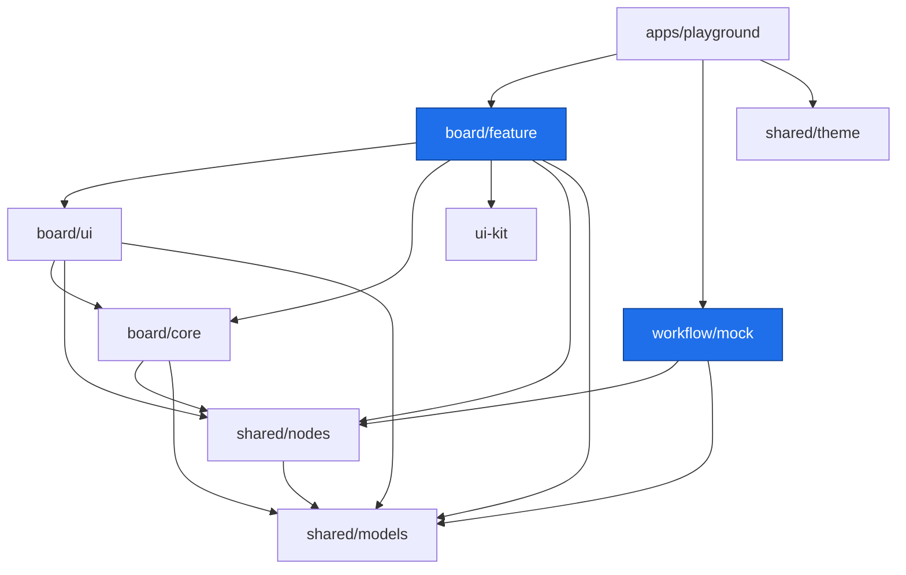

# Architecture

This document describes the architecture of the **Pipeline Editor** monorepo: its
domains, library layers, the canvas data model, the backend contract, and module
boundaries.

The deliverable is a set of **publishable Angular libraries** from which an
external application assembles a visual editor for AI-agent pipelines (inspired by
[n8n](https://n8n.io)). The `playground` app exists for local development only and
is not published.

---

## 1. Goals and principles

1. **The frontend does NOT execute pipelines.** Node semantics are owned by the
   backend (the "system" that runs 24/7). The frontend is a **graph editor + data
   schema + vendor-neutral port** `PipelineBackend` (`startRun` / `observe` /
   `stop`). It draws the graph, validates its structure, and observes a run; it
   does not know what a node actually does. See
   [§6](#6-the-workflow-domain--backend-contract).
2. **Editor ↔ business separation.** The canvas (drawing, navigation, editing the
   graph) knows nothing about concrete integrations. Those are described by the
   node-type registry (`shared/nodes`) and executed by the backend.
3. **Layering.** Every library has a type: `model → util → core → ui → feature`.
   Dependencies only go "top-down"; enforced by tags and
   `@nx/enforce-module-boundaries` (see [§7](#7-module-boundaries)).
4. **Presentational components in `ui`, state in `core`.** UI components are
   "dumb" (`input()/output()`, `OnPush`); state lives in signal stores in the
   `core` layer.
5. **The data model is the single source of truth.** Both the editor and the
   backend operate on one serializable pipeline model from `shared/models`.
6. **Everything through Nx.** Build, test, lint, release — only via
   `nx run/run-many/affected`.

---

## 2. Domains

| Domain       | scope tag        | Purpose                                                                    |
| ------------ | ---------------- | -------------------------------------------------------------------------- |
| **board**    | `scope:board`    | The canvas: graph store, viewport, navigation, nodes, edges, edge routing. |
| **workflow** | `scope:workflow` | Implementations of the `PipelineBackend` port. Today: `mock` (in-browser). |
| **shared**   | `scope:shared`   | Data model, node-type registry, theme, the reusable ui-kit.                |
| **app**      | `scope:app`      | Host application(s): `playground`.                                         |

The **board** domain answers "how it looks and how you drive it with the mouse".
The **workflow** domain answers "which backend runs it". They are linked by the
serializable pipeline model and the `PipelineBackend` contract in `shared/models`.

---

## 3. Library map

```
apps/
  playground/               @scope:app  type:app         host app (nx serve → /board)

packages/                   (folder / nx name    →  npm name)
  shared/
    models/    (models)     @tsai-pe/models        scope:shared type:model  ← types + validation + backend contract
    nodes/     (nodes)      @tsai-pe/nodes         scope:shared type:model  ← node-type registry (derivePorts, catalog, schemas)
    theme/     (theme)      @tsai-pe/theme         scope:shared type:util   ← Tailwind tokens + global CSS
  ui-kit/      (ui-kit)     @tsai-pe/ui-kit        scope:shared type:ui     ← Angular Aria + CDK + Tailwind

  board/
    core/      (core)       @tsai-pe/board-core    scope:board  type:core   ← BoardStore, viewport, geometry, A* routing
    ui/        (ui)         @tsai-pe/board-ui      scope:board  type:ui     ← pe-board-grid, pe-node
    feature/   (feature)    @tsai-pe/board         scope:board  type:feature ← <pe-board> — the public editor (main package)

  workflow/                 (private — not published to npm)
    mock/      (mock)       @tsai-pe/workflow-mock scope:workflow type:core ← TestBackendSystem (mock backend, evaluates expressions)
    http/      (http)       @tsai-pe/workflow-http scope:workflow type:core ← RestWsBackend (REST + WS/SSE adapter, skeleton)
```

> The public scope is **`@tsai-pe`**; names are flat (`@scope/name`, one slash) —
> npm requires it and Angular/Vue/Nx do the same. The domain/layer hierarchy is
> encoded in the name itself (`board-core`, `board-ui`), not a nested path. The
> folders / nx project names keep the nesting.

The node-type registry lives in its own lib `shared/nodes` (not in `models`) on
purpose: it is read by both the editor and the future engine — it is data, not the
logic of any one layer.

### Dependency graph



Key point: **`board/*` and `workflow/*` do not depend on each other** — only via
`shared/*`. The editor can be built with no backend at all; a backend adapter can
be written and tested with no editor.

---

## 4. ui-kit and styling

### 4.1 ui-kit on Angular Aria (type:ui)

Reusable components (buttons, fields, selects, menus, dialogs, toasts, tabs…) are
built on **[Angular Aria](https://angular.dev/guide/aria/overview)** — headless
accessible directives (keyboard, focus, ARIA) **with no visual styles** — plus
`@angular/cdk` for infrastructure: **Overlay** (popovers, menus, modals),
**Portal**, **a11y** (dialog focus trap), **Virtual Scroll** (long lists). All
markup and styles are our own, via Tailwind + theme tokens.

### 4.2 Styling: Tailwind v4 (CSS-first)

We style with **Tailwind v4** without `tailwind.config.js`. The single entry and
tokens live in `@tsai-pe/theme` (`theme.css` — tokens as CSS variables; `index.css`
— `@import "tailwindcss"` + mapping tokens into `@theme` + canvas helpers).

Wiring in the app (`styles.css`):

```css
@import '@tsai-pe/theme';
@source '../../../packages/board'; /* scan classes from the libraries, incl. .ts */
@source '../../../packages/ui-kit';
```

**Styling decision (don't break):** Tailwind everywhere, **including host classes**
via `host: { class: '…' }` in the decorator — Tailwind scans `.ts` thanks to
`@source packages/board`. A component `.css` is allowed **only** for what utilities
can't express (host state, SVG); there is none of that today — the libraries have
no `.css` files. The libraries need no Tailwind build step of their own: the app's
scan picks up their classes.

### 4.3 Theme

Dark-first, "premium/technological" (Linear/Vercel × Apple glass): a single accent
— electric indigo, a neutral near-black background, hairline borders instead of
shadows. Node roles/types are coded with muted tints (a 2px rail, a port dot, an
icon); the node body stays neutral. The light theme mirrors the same tokens
(`class="light"` on `<html>`). `ui-kit` and `shared/theme` are `scope:shared`,
available to all domains, and depend on neither `board` nor `workflow`.

---

## 5. The board domain (canvas)

Visual editing of the graph. Three layers.

### 5.1 `board/core` — state and logic (type:core)

Pure TS + Angular signals, no templates:

- **`BoardStore`** — a signal document store: nodes, edges, selection, history
  (undo/redo, limit 100), clipboard (copy/paste with offset), viewport. Exposes
  read-only signals. Computes `edgeGeometries` (routing of all edges),
  `contentBounds`, live validation `issues`, `ancestorsOf(id)` (a node's ancestors
  in the DAG — the expression context). Validates connections (`canConnect`:
  output→input, no cycle, fan-in allowed).
- **`Viewport`** — pan `{x,y}` + clamped zoom, `screen ↔ world`, `zoomAround`
  (zoom around the cursor), `fitTo`.
- **`geometry`** — the grid (32-px cell), `nodeRect`, `portAnchor` (ports
  distributed by side fraction), rectangle intersection, bezier edge path.
- **`routing`** — orthogonal edge routing on the 16-unit subgrid via **A\***:
  avoids nodes (inflated), softly repels already-routed edges, penalizes turns;
  falls back to a bezier when no path is found.

Depends on: `shared/models`, `shared/nodes`.

### 5.2 `board/ui` — presentational components (type:ui)

"Dumb" `OnPush` components (prefix `pe`):

- **`pe-board-grid`** — the dot-grid background, reacts to the viewport.
- **`pe-node`** — a node's visuals: ports by side fraction, control-flow branch
  labels, run status/progress overlays.

Depends on: `board/core`, `shared/models`, `shared/nodes`.

### 5.3 `board/feature` — the assembled editor (type:feature) · public entry point

The `<pe-board>` component: wires `BoardStore` to the `board/ui` components,
handles keyboard/mouse (pan/zoom with right/middle/Space, marquee selection,
drag-and-drop from the catalog palette, copy/paste, undo/redo, hotkeys, resize,
context menu, alignment guides, delete-safety), draws the minimap and the
issues panel and the run log. The node editor is a wide modal: left side shows
pipeline context (`$json`, `$trigger`, `$node["Title"]`) with draggable JSON
paths; right side renders catalog-driven params, control-flow config, mock runtime
knobs, effect settings and run output. It injects the backend via the
`PIPELINE_BACKEND` token and observes the run. Modals/buttons come from `ui-kit`.

Depends on: `board/core`, `board/ui`, `ui-kit`, `shared/models`, `shared/nodes`.

---

## 6. The workflow domain + backend contract

The frontend contains no execution. It talks to the backend through the
vendor-neutral `PipelineBackend` port (in `shared/models/backend.ts`):

```ts
interface PipelineBackend {
  startRun(pipeline: Pipeline): string; // submit a run → runId
  observe(runId: string, listener: RunListener): Unsubscribe; // subscribe; the
  // listener fires immediately
  // with the current state
  stop(runId: string): void; // request cancellation
}
```

The backend pushes immutable `RunSnapshot`s to observers on every change:
`{ runId, status, nodes: Record<id, NodeRun>, log: RunLogEntry[] }`, where `NodeRun`
carries `status` (idle/running/success/error), optional `error`, `output`, and
`progress: { done, total }` (for split/merge). The contract is **framework-free**
(callbacks, no Signal/Observable) so it can live in `shared` next to the model.

### `workflow/mock` — `TestBackendSystem` (type:core)

An in-browser mock of the "system" that implements `PipelineBackend`. It walks the
graph cooperatively (via `setTimeout`, cancelable) in topological order (Kahn; a
cycle → run rejected) and emits snapshots as nodes transition
idle → running → success/error/skipped. It models:

- **real expressions** — triggers are fake (they push a shape from the catalog
  immediately), but the mock **evaluates** the expression language (`expression.ts`,
  no `eval`): `$json` / `$trigger` / `$node["Title"]`, path access, operators,
  `{{ }}` templates. So control-flow (if/switch/filter) really routes, Set Fields,
  JSON Query, CSV Parse and Markdown Render transform context, and effects resolve
  their params. Reading into a changed shape (a missing path) **throws** → the node
  fails (as in n8n) — fatal, except for an optional effect; the error is highlighted
  on the node and in the inspector. This exercises the language itself;
- **sequential triggers** — a pipeline may have several triggers. A single Run
  plays all triggers as a queue: trigger 1 fires → reachable graph runs → trigger 2
  fires → reachable graph runs, etc. `TestBackendOptions.firingTrigger` can still
  force one trigger for tests/demos. The active event is exposed as `$trigger`
  (`id`, `title`, `type`, `channel`, `event`) so switches can route by trigger
  channel independently from payload shape;
- **control-flow** — only the "taken" branch runs; nodes behind an untaken branch
  are `skipped`;
- **`split → merge` fan-out** — `split ×N` fans the stream out (each node between
  split and merge runs N times, progress n/n, "×N" in the log), `merge` collapses
  back to 1;
- **browser demo effects** — mock-only side-effect events (`toast`, `dialog`,
  `download`, `clipboard`) are emitted by the mock backend but rendered by the
  playground. The board package stays backend-agnostic and never owns browser side
  effects;
- **mock runtime knobs** — any node may set `__mockDelayMs` and `__mockFailure`
  through the inspector; the `delay` node uses the same timing path explicitly;
- **errors** — fatal ones fail the run; an optional `effect` (`required: false`,
  e.g. a logger or visual side effect) does not.

A real REST/WS adapter is just another implementation of the same port; the editor
can't tell them apart. It is injected into `<pe-board>` via `PIPELINE_BACKEND`.

### Persistence — the `PipelineStore` port

A port separate from running (`shared/models/store.ts`): `save` / `load` / `list` /
`remove` pipelines + `runHistory`. It is **async** (Promise-based) — persistence is
inherently remote (unlike the sync run port). `InMemoryPipelineStore` and
`LocalStoragePipelineStore` (`workflow/mock`) are in-browser implementations: they
deep-clone documents on the way in and out, so stored state can't be mutated by
reference. The playground uses localStorage to preserve edits across refreshes and
seeds the demo only when storage is empty. A real REST store is another
implementation of the same port.

### `workflow/http` — `RestWsBackend` (type:core)

A skeleton of a real port implementation: commands over **REST** (`POST /runs`,
`POST /runs/{id}/stop`), run snapshots over a stream (**WebSocket**/SSE). It proves
the contract against a real transport. The transport (`fetch` + a socket factory)
is injected — the lib stays headless and unit-testable without a network.

**A seam found (sync/async).** The port's `startRun` returns an id **synchronously**,
while REST assigns one **asynchronously**. The solution: the adapter returns a
**local** id up front, POSTs in the background, and once it has the server id opens
the stream and **relabels** server snapshots onto the local id. The caller only
sees the local id and never the reconciliation. This is a signal for future
"contract maturity": `startRun` may want to become async.

---

## 7. Module boundaries

Defined in `eslint.config.mjs` (`@nx/enforce-module-boundaries`), checked by lint.
An import is allowed only if it satisfies **both** the scope and the type
constraints.

### Scope (which domain sees which)

| sourceTag        | may depend on                                                |
| ---------------- | ------------------------------------------------------------ |
| `scope:shared`   | `scope:shared`                                               |
| `scope:board`    | `scope:board`, `scope:shared`                                |
| `scope:workflow` | `scope:workflow`, `scope:shared`                             |
| `scope:app`      | `scope:app`, `scope:board`, `scope:workflow`, `scope:shared` |

### Type (layering)

| sourceTag      | may depend on                            |
| -------------- | ---------------------------------------- |
| `type:app`     | `feature`, `ui`, `core`, `util`, `model` |
| `type:feature` | `feature`, `ui`, `core`, `util`, `model` |
| `type:ui`      | `ui`, `core`, `util`, `model`            |
| `type:core`    | `core`, `util`, `model`                  |
| `type:util`    | `util`                                   |
| `type:model`   | `model`                                  |

`shared/nodes` is tagged `type:model`: it depends only on `shared/models`
(`model → model`), and every consumer (`core`/`ui`/`feature`/`app`) is allowed to
pull `type:model`. So `ui-kit` (`type:ui`) technically could depend on `type:core`,
but the scope rule won't let it pull `board/core` (`scope:board`) — both
constraints must hold at once.

---

## 8. Data model

A single serializable model in `shared/models` — the editor ↔ backend contract.

```ts
// grid-based coordinates (in cells of the 32-grid)
type NodeKind = 'trigger' | 'action' | 'effect';
type ActionCategory = 'control-flow' | 'transform' | 'integration' | 'split' | 'merge';

interface NodePort {
  id: string;
  role: 'input' | 'output';
  side: 'left' | 'right' | 'top' | 'bottom';
  label?: string; // e.g. a control-flow branch name ("true"/"false")
}

interface BoardNode {
  id: string;
  kind: NodeKind;
  category?: ActionCategory; // for kind === 'action'
  type?: string; // a concrete catalog type (e.g. 'llm-agent')
  title: string;
  pos: GridPos; // { col, row } — cells
  size: CellSize; // { cols, rows }
  ports: NodePort[]; // derived by the registry from kind/config
  config?: NodeConfig; // control-flow only (if/switch/filter)
  data?: Record<string, unknown>; // node parameter values
  status?: NodeStatus; // run overlay
}

interface Edge {
  // output port → input port
  id: string;
  source: { nodeId: string; portId: string }; // output
  target: { nodeId: string; portId: string }; // input
}

interface Pipeline {
  id: string;
  name: string;
  nodes: BoardNode[];
  edges: Edge[];
}
```

**Fan-in is allowed.** An input accepts **multiple** incoming connections (OR /
run-on-arrival semantics): distinct sources — e.g. several telegram/whatsapp/slack
triggers — converge on one node that fires when any of them delivers. This is a
union of sources, and it is orthogonal to `split`/`merge`, which are about the
cardinality of **one** stream (`split` hands out array elements, `merge` buffers N
events into an `Array[N]`), not about joining different ones. Validation
(`validatePipeline` in `models`): the graph is a DAG (no cycles), a connection runs
`output → input`, disconnected nodes are a warning. `connect` never creates a
duplicate of the same connection.

### Node-type registry — `shared/nodes`

The registry (n8n-style) is read by both the editor and the future engine:

- **control-flow** (`if`/`switch`/`filter`) — a fixed set with its own form; output
  ports are **derived from config** (`derivePorts` / `controlFlowOutputs`),
  `defaultControlFlowConfig` gives the starting configuration.
- **trigger / integration / effect** — **open-ended**: each concrete `node.type`
  from `NODE_CATALOG` has its own parameter schema (`ParamField[]`, `paramSchema`),
  values live in `node.data`. The catalog here is a seed; a real backend supplies
  its own.

---

## 9. Playground

`apps/playground` (`scope:app`, `type:app`) is a minimal app for local development
and e2e (Playwright). It mounts `<pe-board>` on the `/board` route, injects
`TestBackendSystem` via `PIPELINE_BACKEND`, injects `LocalStoragePipelineStore` via
`PIPELINE_STORE`, renders mock side-effect events (toast/dialog/download/clipboard)
and provides a Reset button that clears storage back to the seed pipeline. Not
published.

---

## 10. Tests, build, and release

- **Tests — Vitest.** Each tested lib has a `vitest.config.mts` and an inferred
  `vite:test` target (`@nx/vite/plugin`), `node` environment. The pure layers are
  covered: `models` (validation/helpers), `nodes` (registry), `core`
  (geometry/viewport/routing/BoardStore), `mock` (`TestBackendSystem`). The Angular
  libs (`board`, `board-ui`, `ui-kit`) use `@nx/angular:unit-test` (`test` target).
- **Libraries are buildable** (`@nx/js:tsc` / Angular build), lint via ESLint.
- Each lib's public API is only via `src/index.ts` (barrel), no "deep" imports
  between packages.
- Release via `nx release` (independent versions, conventional commits).

```bash
npx nx serve playground              # demo editor at /board
npx nx run-many -t test vite:test    # unit tests
npx nx affected -t lint test build   # only what changed (CI)
npx nx run-many -t build             # build all libraries
```

---

## 11. Generating libraries

Libraries are created with Nx generators and the correct tags (via the
`nx-generate` skill; exact flags there). For reference:

```bash
# shared (headless — @nx/js)
npx nx g @nx/js:lib packages/shared/models --tags=scope:shared,type:model
npx nx g @nx/js:lib packages/shared/nodes  --tags=scope:shared,type:model
npx nx g @nx/js:lib packages/shared/theme  --tags=scope:shared,type:util

# ui-kit + board/ui/feature (Angular; ui-kit on @angular/aria + @angular/cdk)
npx nx g @nx/angular:lib packages/ui-kit         --tags=scope:shared,type:ui
npx nx g @nx/angular:lib packages/board/ui       --tags=scope:board,type:ui
npx nx g @nx/angular:lib packages/board/feature  --tags=scope:board,type:feature

# board/core — framework-light (signals only), headless @nx/js
npx nx g @nx/js:lib packages/board/core --tags=scope:board,type:core

# workflow (headless — @nx/js)
npx nx g @nx/js:lib packages/workflow/mock --tags=scope:workflow,type:core

# playground
npx nx g @nx/angular:app apps/playground --tags=scope:app,type:app
```

> After generating, check the tags in `project.json` and the boundaries:
> `npx nx graph`.
